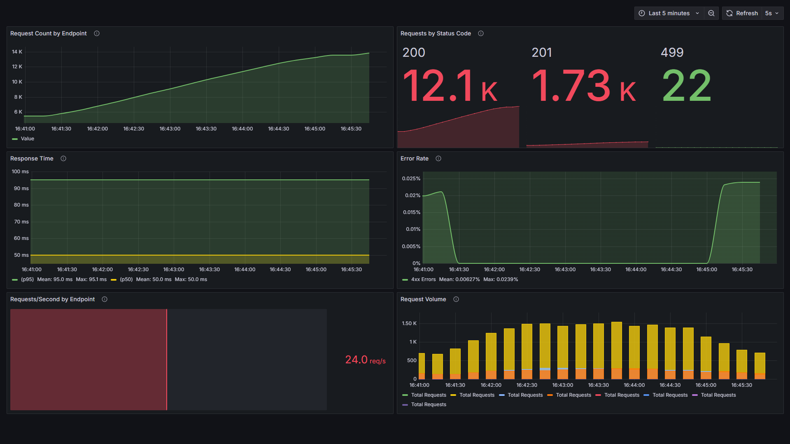
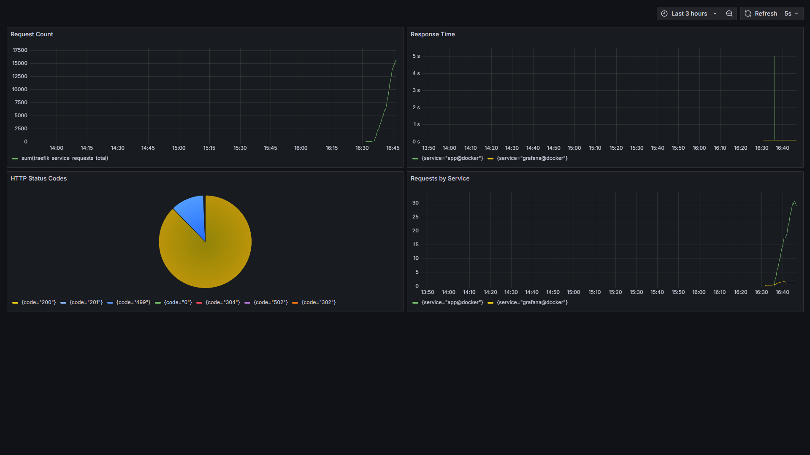

# Infrastructure Setup with Docker Compose

```
docker compose --pull up -d
```

This setup includes the following services:
- http://traefik.localhost - Reverse proxy and load balancer
- http://grafana.localhost - Dashboard for visualization
- http://prometheus.localhost - Metrics collection
- http://app.localhost - Symfony Skeleton Application with some Fake API calls

# Grafana

Username: admin
Password: admin

## Dashboards 





# Volume testing

Included a volume-testing container that fires requests at the service at 10vus.
